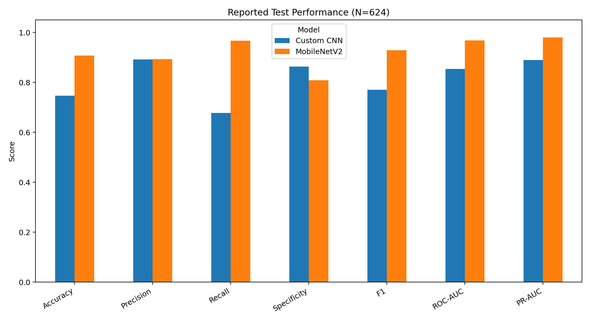
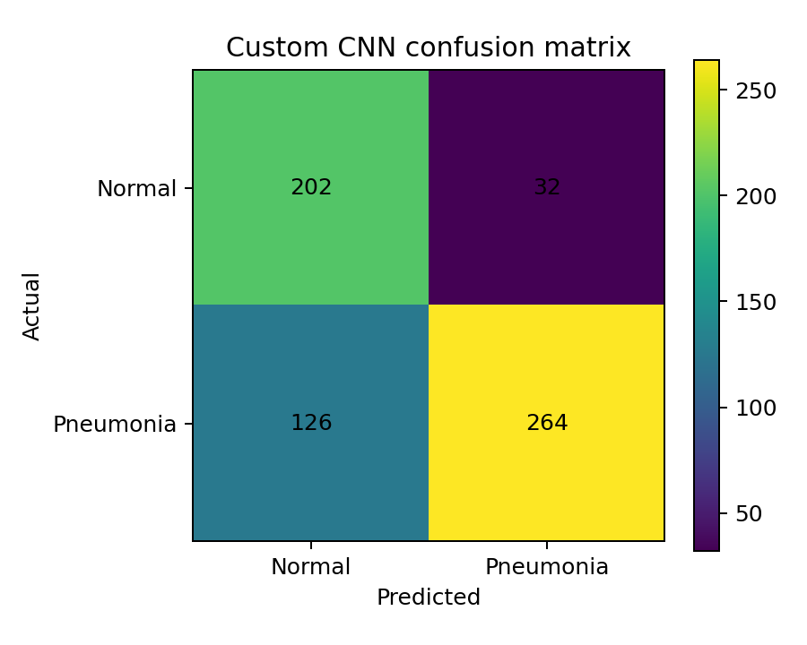
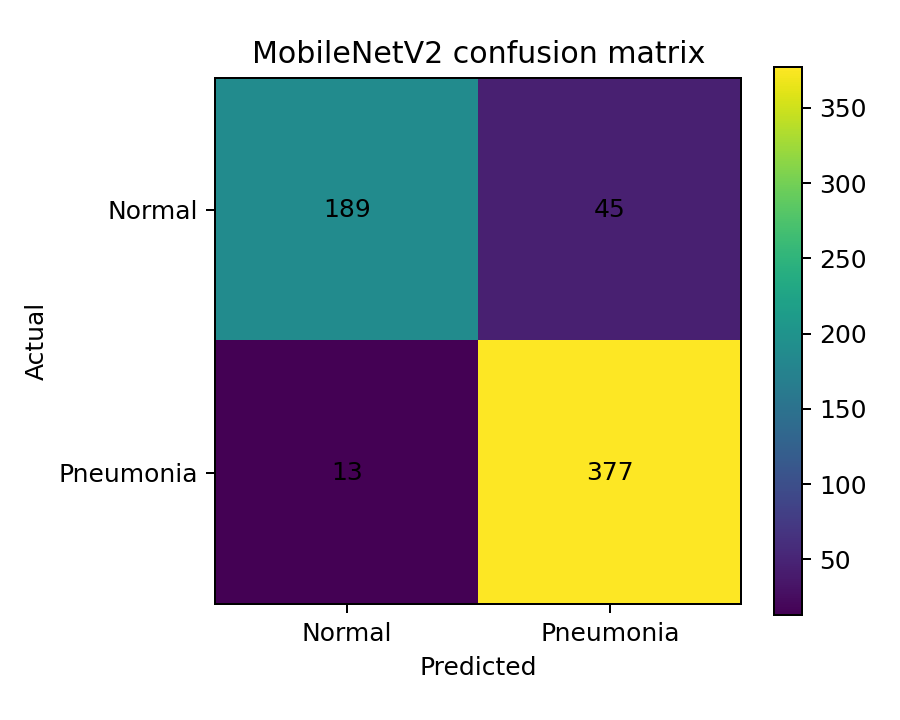

# Pneumonia Detection from Chest X-Rays

A healthcare artificial-intelligence project comparing a compact custom convolutional neural network (CNN) with a MobileNetV2 transfer-learning model for binary classification of chest X-rays as **NORMAL** or **PNEUMONIA**.

This repository is a cleaned portfolio edition of an MSc dissertation notebook. It focuses on the modelling workflow, evaluation, explainability and limitations. It does **not** include the image dataset, patient images, trained model binaries or private Google Drive paths.

## Project summary

The original workflow:

1. Audited the Kaggle chest X-ray train, validation and test splits.
2. Addressed class imbalance using a balanced training subset and additional normal-image experiments.
3. Trained a compact custom CNN.
4. Trained and lightly fine-tuned a pretrained MobileNetV2 model.
5. Evaluated both models using accuracy, precision, recall, specificity, F1, ROC-AUC, PR-AUC and confusion matrices.
6. Explored model attention using Grad-CAM for the custom CNN and input-gradient saliency for MobileNetV2.

## Reported results

The uploaded dissertation notebook reports the following results on a 624-image test set:

| Model | Threshold | Accuracy | Precision | Recall | Specificity | F1 | ROC-AUC | PR-AUC |
|---|---:|---:|---:|---:|---:|---:|---:|---:|
| Custom CNN | 0.05 | 0.747 | 0.892 | 0.677 | 0.863 | 0.770 | 0.854 | 0.889 |
| MobileNetV2 | 0.70 | 0.907 | 0.893 | 0.967 | 0.808 | 0.929 | 0.968 | 0.980 |



### Confusion matrices

| Custom CNN | MobileNetV2 |
|---|---|
|  |  |

## Repository structure

```text
pneumonia-detection-xray-ai/
├── README.md
├── pneumonia_detection_portfolio.ipynb
├── requirements.txt
├── DATASET.md
├── .gitignore
├── assets/
│   ├── model_comparison.png
│   ├── ccnn_confusion_matrix.png
│   └── mobilenetv2_confusion_matrix.png
└── results/
    └── reported_metrics.csv
```

## Running the notebook

Create a Python environment and install the dependencies:

```bash
python -m venv .venv
source .venv/bin/activate
pip install -r requirements.txt
jupyter notebook
```

Open `pneumonia_detection_portfolio.ipynb`, set `DATA_ROOT` to the local dataset directory and run the cells in order.

Expected dataset layout:

```text
chest_xray/
├── train/
│   ├── NORMAL/
│   └── PNEUMONIA/
├── val/
│   ├── NORMAL/
│   └── PNEUMONIA/
└── test/
    ├── NORMAL/
    └── PNEUMONIA/
```

## Important limitations

- The original validation split contained only 16 images, making validation metrics and early stopping unstable.
- The reported decision thresholds were selected using the test set because the validation set was too small. This introduces optimistic bias and is not suitable for a final clinical evaluation.
- Patient-level separation was not confirmed in the notebook, so data leakage cannot be ruled out.
- Images were resized to 150–160 pixels, which may remove subtle radiographic detail.
- The explainability methods differed between models, limiting direct comparison.
- This project is an academic machine-learning experiment, **not a medical device and not suitable for diagnosis or clinical use**.

## Recommended next development step

Create a larger patient-level validation split, choose thresholds only on validation data, lock the complete pipeline, and evaluate once on an untouched test set.

## Skills demonstrated

Python, Pandas, NumPy, TensorFlow/Keras, convolutional neural networks, transfer learning, image preprocessing, data augmentation, class-imbalance handling, threshold analysis, ROC/PR evaluation, confusion matrices, Grad-CAM, saliency analysis and critical discussion of healthcare-AI limitations.
